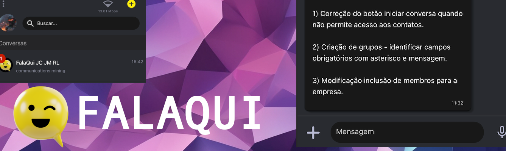
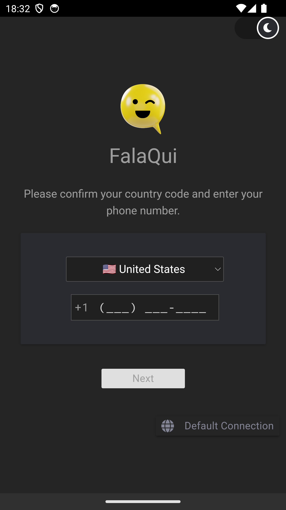
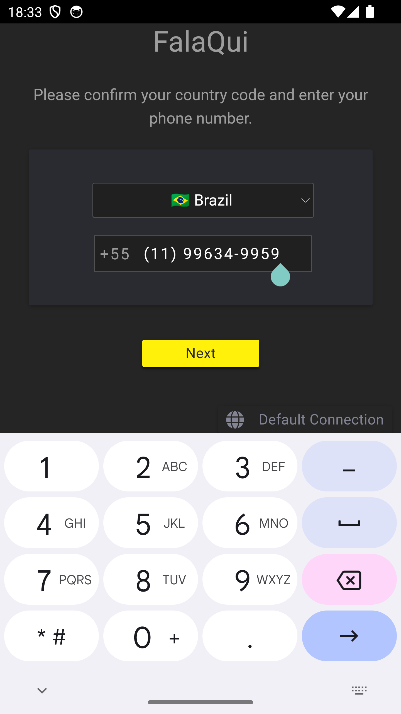
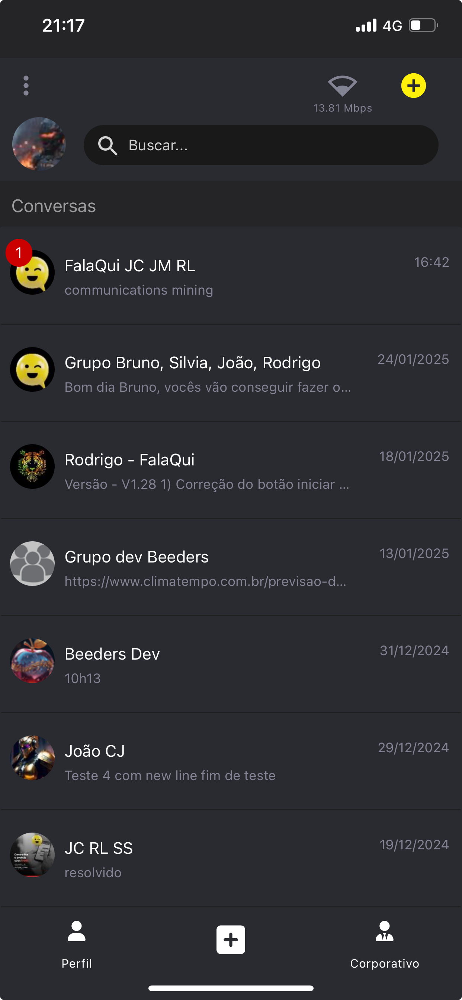
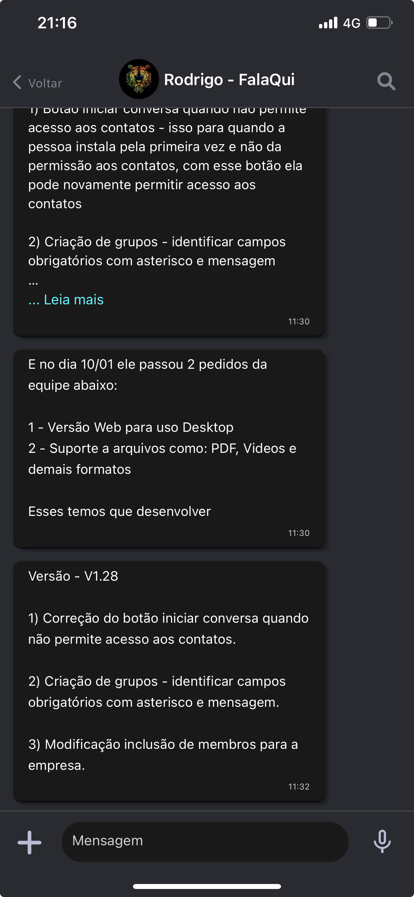
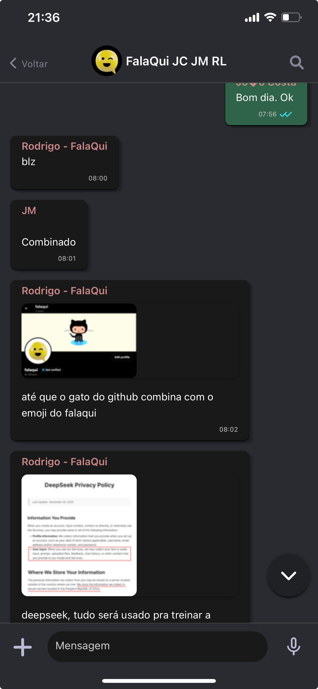
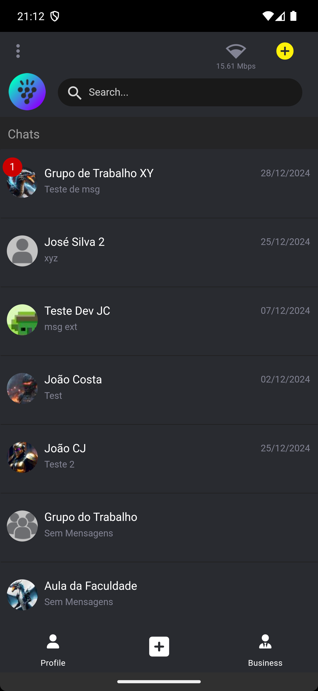
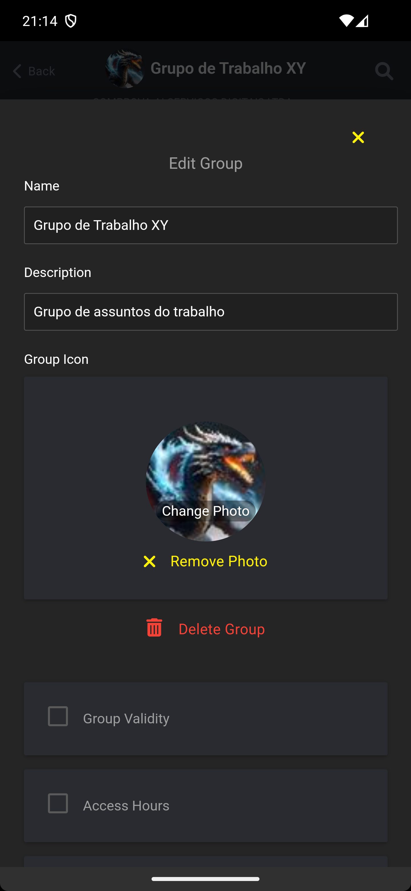
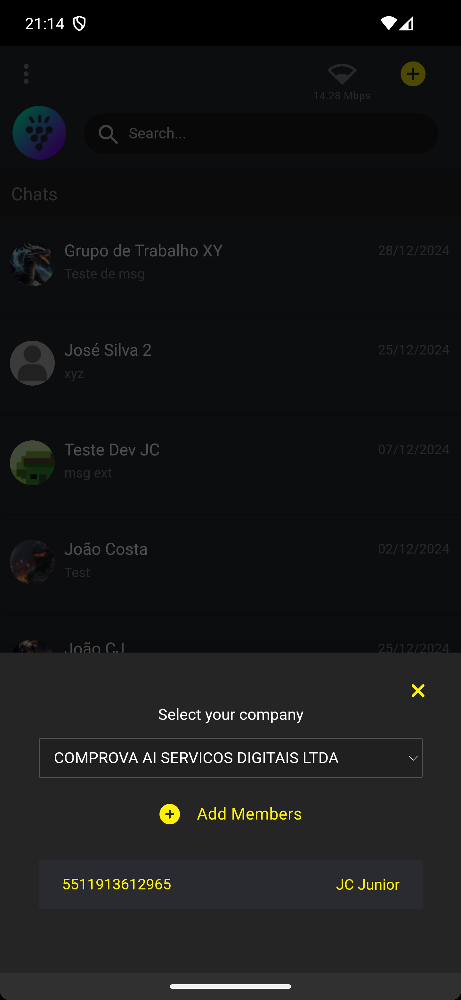
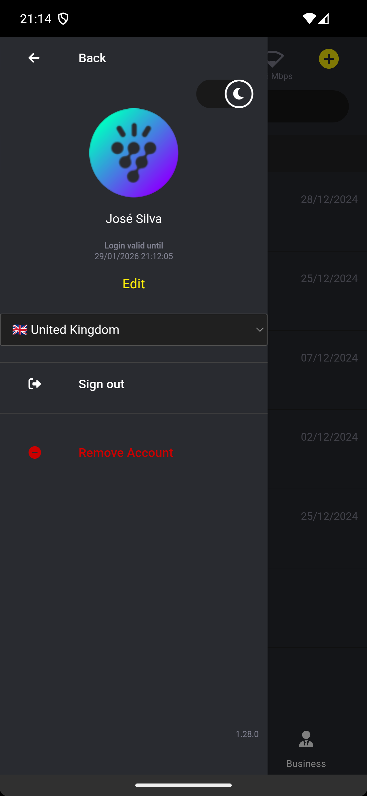

# Falaqui - Aplicativo de Chat de Código Aberto



**Falaqui** é um aplicativo de chat simples, privado e seguro, projetado para uso pessoal e corporativo. Com criptografia de ponta a ponta, acesso a mensagens offline e suporte para texto, mídia, transcrições de áudio e muito mais, o Falaqui pretende ser uma alternativa de código aberto a aplicativos de chat populares como WhatsApp e Telegram.

*This article can also be read in [English](README.md).*

## Índice
- [Sobre](#sobre)
- [Recursos](#recursos)
- [Capturas de Tela](#capturas-de-tela)
- [Tecnologias Utilizadas](#tecnologias-utilizadas)
- [Instalação](#instalação)
- [Licença](#licença)
- [Agradecimentos](#agradecimentos)

## Sobre


O Falaqui é um aplicativo de chat de código aberto que prioriza a privacidade e a segurança. Ele permite que os usuários enviem mensagens, compartilhem arquivos e se comuniquem em grupos com criptografia de ponta a ponta. Quer você esteja conversando com amigos, familiares ou colegas de trabalho, o Falaqui garante que suas conversas permaneçam privadas e seguras.

### Motivação
A motivação por trás do Falaqui é fornecer uma alternativa transparente e segura aos aplicativos de chat de código fechado que podem coletar ou reter dados sensíveis dos usuários. Por ser de código aberto, o Falaqui permite que os usuários verifiquem a segurança e a privacidade do aplicativo por si mesmos.

### Objetivos
- Fornecer uma plataforma de mensagens segura e privada.
- Oferecer uma alternativa de código aberto aos aplicativos de chat populares.
- Suportar necessidades de comunicação pessoais e corporativas.

## Recursos

- **Mensagens Instantâneas**: Envie e receba mensagens de texto instantaneamente.
- **Transcrição de Áudio**: Envie e receba mensagens de áudio com transcrição automática.
- **Compartilhamento de Mídia**: Compartilhe fotos e imagens com segurança.
- **Integração de Contatos**: Encontre contatos diretamente da sua lista telefônica.
- **Comunicação em Grupo**: Crie e gerencie grupos para uso pessoal ou corporativo.
- **Recursos Corporativos**: Defina restrições de data e hora para acesso a grupos corporativos.

## Capturas de Tela

| Tela Inicial | Tela de Login | Login com Número de Telefone Localizado |
|--------------|--------------|-----------------------------------------|
|  |  |  |

| Tela Principal | Tela de Chat | Tela de Chat com Mídia |
|----------------|--------------|------------------------|
|  |  |  |

| Tela Principal com Notificação | Tela de Criação/Edição de Grupo | Tela de Configuração da Empresa | Tela de Configurações da Conta |
|--------------------------------|--------------------------------|--------------------------------|--------------------------------|
|  |  |  |  |

## Tecnologias Utilizadas

### Backend
- **Node.JS** com **Express**
- **Servidor Websocket** para chat individual e em grupo
- **Redis** para cache de informações do servidor
- **Whisper** para transcrição de áudio no servidor

### Banco de Dados
- **Servidor MySQL**

### Notificações Push
- **Firebase Cloud Messaging** (Android e iOS)

### Frontend
- **Apache Cordova**
- **JavaScript**
- **MaterializeCSS**
- **Pug** (Pré-processador HTML)

### Plugins do Apache Cordova
- **Swift** e **ObjectiveC** para iOS
- **Java** para Android
- **C/C++** para iOS e Android
- **WhisperCPP** para transcrição de áudio no cliente (transcrição offline)

## Instalação

### Comece e Execute

Esta seção está atualmente em construção. Por favor, volte mais tarde para obter instruções detalhadas sobre como configurar e executar o Falaqui localmente.

#### Requisitos

É necessário um conjunto de instalação e configuração, tais como:
- Node.JS
- Servidor MySQL
- Redis
- Firebase Cloud Messaging
- C/C++ Build Environment
- \+ um conjunto de pacotes de apoio

Siga a seguir as instruções para começar a configurar o seu ambiente.

##### 1. Requisitos de Configuração do Servidor

Escolha a plataforma no qual deseja montar seu ambiente e siga as instruções conforme o link relacionado.

| Plataforma             | Instruções                                   |
|------------------------|---------------------------------------------|
| **Linux Ubuntu**       | [Guia de Configuração de Requisitos do Linux Ubuntu (em inglês)](docs/platforms/linux-ubuntu/requirements/README.md) |
| **MacOS Apple Silicon** | [Guia de Configuração de Requisitos do MacOS (em inglês)](docs/platforms/mac/requirements/README.md) |
| **Windows**            | [Guia de Configuração de Requisitos do Windows (em inglês)](docs/platforms/win/requirements/README.md) |

*Observação: Essas instruções podem ser adaptadas para outras plataformas além das listadas acima.*

##### 2. Configuração do Servidor
Faça o download ou clone a versão mais recente do código.

###### 2.1 Inicialização do Servidor de Desenvolvimento
Para fins de desenvolvimento, você pode simplesmente executar:
```bash
node server.js
```

###### 2.2 Inicialização do Servidor de Produção (Daemon)
Para executar o servidor em segundo plano (daemon) com NODE_ENV em "modo de produção", use o comando PM2:
```bash
pm2 start start-flq-server-ecosystem.json --env production
```
*Nota: O arquivo de ecossistema start-flq-server-ecosystem.json contém a configuração do ambiente para produção.*

Para facilitar os usuários de MacOS e Linux, há o script shell start-flq-server.sh que pode ser usado para iniciar o processo.
```bash
./start-flq-server.sh
```

Para saber mais sobre o PM2 e seus comandos, consulte a documentação do PM2 em https://pm2.keymetrics.io/docs/usage/process-management.


#### Requisitos para a Construção do App para Telefone
Em breve...

#### Construção do App para Telefone
Em breve...

## Licença

O Falaqui é licenciado sob a **Licença AGPL-3.0**. Esta licença permite que você:
- Use o software para qualquer finalidade.
- Modifique e distribua o software.
- Use o software comercialmente.

No entanto, quaisquer modificações ou distribuições também devem ser licenciadas sob a Licença AGPL-3.0, e o código-fonte deve ser disponibilizado aos usuários.

## Lojas de Aplicativos Oficiais

- **Apple Store**: [Baixe na App Store](https://apps.apple.com/us/app/falaqui/id6503642039)
- **Google Play**: [Disponível no Google Play](https://play.google.com/store/apps/details?id=com.br.falaqui)
- **Samsung Galaxy**: [Baixe na Samsung Galaxy Store](https://galaxystore.samsung.com/detail/com.br.falaqui)

## WebSites Oficiais

- **Principal: Português (pt-BR)**: [Visit](https://FalaQui.com.br)
- **Versão em Inglês**: [Visit](https://FalaQui.com)
- **Versão Org (pt-BR)**: [Visit](https://FalaQui.org)

---

**Falaqui** - Sua solução de chat privada, segura e de código aberto.
