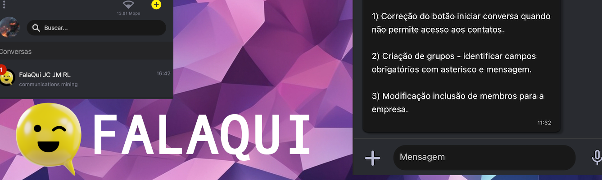
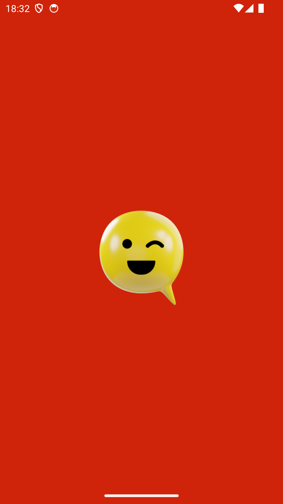
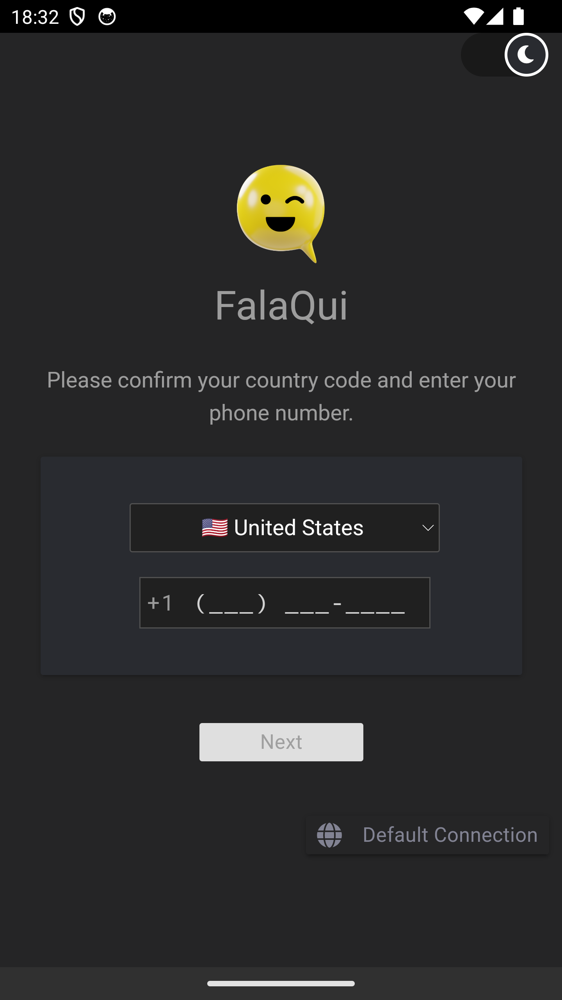
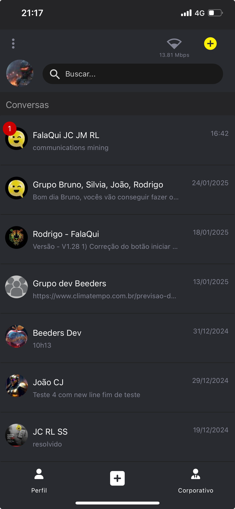
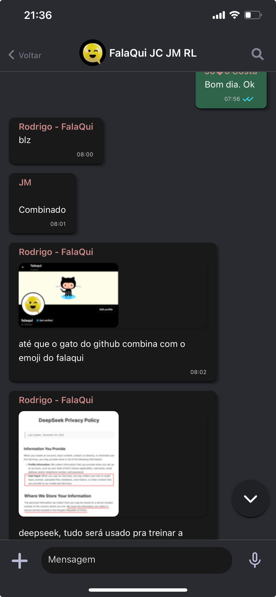
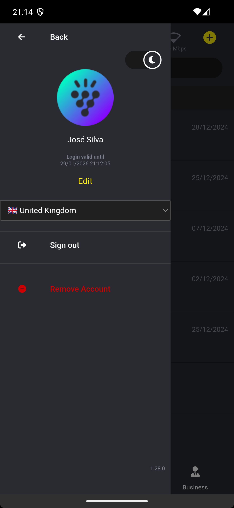

# Falaqui - Open Source Chat Application



**Falaqui** is a simple, private, and secure chat application designed for both personal and business use. With end-to-end encryption, offline message access, and support for text, media, audio transcripts, and more, Falaqui aims to be an open-source alternative to popular chat apps like WhatsApp and Telegram.

*This article can also be read in [Brazilian Portuguese](README-pt-BR.md).*

## Table of Contents
- [About](#about)
- [Features](#features)
- [Screenshots](#screenshots)
- [Tech Stack](#tech-stack)
- [Installation](#installation)
- [License](#license)

## About


Falaqui is an open-source chat application that prioritizes privacy and security. It allows users to send messages, share files, and communicate in groups with end-to-end encryption. Whether you're chatting with friends, family, or coworkers, Falaqui ensures your conversations remain private and secure.

### Motivation
The motivation behind Falaqui is to provide a transparent and secure alternative to closed-source chat applications that may collect or retain sensitive user data. By being open-source, Falaqui allows users to verify the security and privacy of the application themselves.

### Goals
- Provide a secure and private messaging platform.
- Offer an open-source alternative to popular chat apps.
- Support both personal and corporate communication needs.

## Features

- **Instant Messaging**: Send and receive text messages instantly.
- **Audio Transcription**: Send and receive audio messages with automatic transcription.
- **Media Sharing**: Share photos and images securely.
- **Contact Integration**: Find contacts directly from your phonebook.
- **Group Communication**: Create and manage groups for personal or corporate use.
- **Corporate Features**: Set date and time restrictions for corporate group access.

## Screenshots

| Splashscreen | Login Screen | Login with Localized Phone Number |
|--------------|--------------|-----------------------------------|
|  |  |  |

| Home Screen | Chat Screen | Chat Screen with Media |
|-------------|-------------|------------------------|
|  |  |  |

| Home Screen with Notification | Group Create/Edit Screen | Company Setup Screen | Account Settings Screen |
|-------------------------------|--------------------------|----------------------|-------------------------|
|  |  |  |  |

## Tech Stack

### Backend
- **Node.JS** with **Express**
- **Websocket Server** for individual and group chat
- **Redis** for caching server information
- **Whisper** for server-side audio transcription

### Database
- **MySQL Server**

### Push Notification
- **Firebase Cloud Messaging** (Android and iOS)

### Frontend
- **Apache Cordova**
- **JavaScript**
- **MaterializeCSS**
- **Pug** (HTML Pre-processor)

### Apache Cordova Plugins
- **Swift** and **ObjectiveC** for iOS
- **Java** for Android
- **C/C++** for iOS and Android
- **WhisperCPP** for client-side audio transcription (offline transcription)

## Installation

### Get Started and Run

This section is currently under construction. Please check back later for detailed instructions on how to set up and run Falaqui locally.

#### 1. Requirements

A set of installation and configuration is required, such as:
- Node.JS
- MySQL Server
- Redis
- Firebase Cloud Messaging
- C/C++ Build Environment
- \+ a set of support packages

Follow the instructions below to start setting up your environment.

##### Server Setup Requirements

Choose the platform on which you want to set up your environment and follow the instructions as per the related link.

| Platform             | Instructions                                   |
|----------------------|-----------------------------------------------|
| **Linux Ubuntu**     | [Linux Ubuntu Requirements Setup Guide](docs/platforms/linux-ubuntu/requirements/README.md) |
| **MacOS Apple Silicon** | [MacOS Requirements Setup Guide](docs/platforms/mac/requirements/README.md) |
| **Windows**          | [Windows Requirements Setup Guide](docs/platforms/win/requirements/README.md) |

*Note: These instructions can be adapted to platforms other than those listed above.*

#### 2. Server Setup
Download or clone the latest version of the code.

##### 2.1 Development Server Start
For development purposes you may just run:
```bash
node server.js
```

##### 2.2 Production Server Start (Daemon)
To run the server in background (daemon) with NODE_ENV in "production mode", use the PM2 command:
```bash
pm2 start start-flq-server-ecosystem.json --env production
```
*Note: The ecosystem file start-flq-server-ecosystem.json contains the environment configuration for production.*

To facilitate MacOS and Linux users there are the shell script start-flq-server.sh that can be used to start the process.
```bash
./start-flq-server.sh
```

To know more about PM2 and its commands, please check the PM2 documentation at https://pm2.keymetrics.io/docs/usage/process-management.


### Mobile App Build Requirements
The app build uses a configuration file to set the environment variables for the build process. The build is made by an automated script that reads the configuration file and sets the values for the build process.

The mobile app build is made to work under Linux Ubuntu and MacOS. The Windows platform was not yet tested and may not work.

#### 1. Install Development Tools

- **Falaqui Server**: The Falaqui Server must be running in the development environment or in a server accesible through the internet. The Falaqui Server is the backend of the Falaqui App and is responsible for the chat, user authentication, and other features. Follow the instructions in the [Server Setup](#server-setup) section to set up the Falaqui Server.

- **XCode**: For iOS builds (MacOS only). Download from the App Store: [XCode](https://apps.apple.com/us/app/xcode/id497799835)

- **Android Studio**: For Android builds. Download from the official website: [Android Studio](https://developer.android.com/studio) and set the Android SDK path in the environment variable ANDROID_HOME and the deprecated ANDROID_SDK_ROOT.

- **Android SDK Stable Version**: It should be installed the latest stable version with Android Studio. But if you need to get a different version you can use the following command:

Example to install the Android SDK in Ubuntu:
```bash
sudo snap install androidsdk
```

Example to install the Android SDK in MacOS:
```bash
brew install androidsdk
```

Example to set the Android SDK version 34.0.0:
```bash
androidsdk "platform-tools" "tools" "build-tools;34.0.0" "platforms;android-34"
```

- **Java Development Kit (JDK)**: For Android builds. Download from the Oracle a correct version of Java and set the JDK path in the environment variable JAVA_HOME. At the time of this documentation, the latest version of JDK for better use in Cordova project is Java 17.

Example to install Java 17 in Ubuntu:
```bash
sudo apt install openjdk-17-jdk
```

Example to install Java 17 in MacOS:
```bash
brew install openjdk@17
```

If you are working with multiple versions of JDK in your Linux Ubuntu, you may set the JDK version using the following command:
```bash
sudo update-alternatives --config java
```

- **Node.JS**: Use the version 23 or later. Download from the official website: [Node.JS](https://nodejs.org/en/download/) or use the following command to install the latest version:

For Linux Ubuntu:
```bash
curl -fsSL https://deb.nodesource.com/setup_23.x -o nodesource_setup.sh
sudo -E bash nodesource_setup.sh
sudo apt install -y nodejs
```

For MacOS:
```bash
brew install node
```

- **Gradle**: It should be installed with the Android Studio. But if you have any problems with unavailability of Gradle you may install it separately. Download from the official website: [Gradle](https://gradle.org/install/) and set the Gradle path in the environment variable GRADLE_HOME.
Be sure to use the compatible version of Gradle with the JDK version. Check the site: [Gradle Compatibility](https://docs.gradle.org/current/userguide/compatibility.html)
Example for JDK 17 you may try to use the Gradle 7.2 but some environments work better with Gradle 8.7.

- **Enviroment Variables**: The environment variables after all installations should be set as follows:
    - **ANDROID_HOME**: Android SDK path.
    - **ANDROID_SDK_ROOT**: Android SDK path.
    - **JAVA_HOME**: JDK path.
    - **GRADLE_HOME**: Gradle path.

#### 2. Create the Configuration File

Create the setup-cordova-build.cfg file based on the setup-cordova-build.cfg-template file and set the values according to your environment.

Important production values to be set:
- **SERVERENDPOINT**: Server (Backend) endpoint is the HTTPS domain address pointing to the server where the backend is running. IMPORTANT: The address must be https with a valid SSL certificate.
- **SOCKETENDPOINT**: Socket endpoint endpoint is the WSS domain address pointing to the server where the backend is running. IMPORTANT: The address must be wss with a valid SSL certificate.
- **CONFIGHOSTNAME**: Config hostname is the domain address pointing to the server where the backend is running.
- **GOOGLETAGMANAGER**: Google Tag Manager if available.
- **BUNDLEIDMARKET**: Bundle ID market is the part of your bundle ID that identifies the market where the app is being published. For example, if your bundle ID is com.mydomain.myapp, the BUNDLEIDMARKET is mydomain.
- **JSOBFUSCATOR**: JavaScript obfuscator (true or false).
- **SAMSUNGGALAXYSTOREBUILD**: Samsung Galaxy Store build is the flag to indicate if the build is for the Samsung Galaxy Store (0 for false or 1 for true).
- **CAMERA_USAGE_REASON**: Camera usage reason to inform the app store.
- **PHOTO_LIBRAY_USAGE_REASON**: Photo library usage reason to inform the app store.
- **CONTACT_LIST_USAGE_REASON**: Contact list usage reason to inform the app store.
- **MICROPHONE_USAGE_REASON**: Microphone usage reason to inform the app store.

Other values to be set:
- **THEME_COLOR**: Theme color.
- **DEFAULT_THEME**: Default theme.
- **ANDROIDSPLASHSCREENMODE**: Android splash screen mode.
- **SPLASHBACKGROUNDCOLOR**: Splash screen background color.
- **SPLASHICONSVGBACKGROUNDCOLOR**: Splash icon SVG background color.
- **SPLASHICONSVGSTROKECOLOR**: Splash icon SVG stroke color.
- **KEYWORDS**: Keywords for the app.
- **SPLASHSCREENDELAY**: Splash screen delay.
- **FADESPLASHSCREENDURATION**: Fade splash screen duration.
- **USEINTERNALSPLASHSCREEN**: Use internal splash screen.
- **APPWEBSITE**: App website if available.
- **PRODUCTVERSION**: Product version for internal use. It is not the app version.

Example:
```
CAMERA_USAGE_REASON="We need access to your camera so that we can send documents with photos or identify your profile."
PHOTO_LIBRAY_USAGE_REASON="We need access to your photo library so we can upload documents with photos or identify your profile."
CONTACT_LIST_USAGE_REASON="We need access to your device's contact list description to facilitate your interaction with creditors and beneficiaries."
MICROPHONE_USAGE_REASON="We need microphone access to record sounds."
THEME_COLOR="#157fcc"
DEFAULT_THEME="dark" # dark | light
ANDROIDSPLASHSCREENMODE="image" # xml | image
SPLASHBACKGROUNDCOLOR="#CF240A"
SPLASHICONSVGBACKGROUNDCOLOR="#CF240A"
SPLASHICONSVGSTROKECOLOR="#CF240A"
KEYWORDS="falaqui, social chat, p2p, conversation, chat, social, social network, social media, social app, social platform, social network app, social network platform, social media app, social media platform, social chat app, social chat platform, social chat network, social chat network app, social chat network platform, social chat media, social chat media app, social chat media platform, social chat conversation, social chat conversation app, social chat conversation platform, social chat p2p, social chat p2p app, social chat p2p platform, social chat p2p network, social chat p2p network app, social chat p2p network platform, social chat p2p media, social chat p2p media app, social chat p2p media platform, social chat p2p conversation"
SPLASHSCREENDELAY="50"
FADESPLASHSCREENDURATION="100"
USEINTERNALSPLASHSCREEN="0"
APPWEBSITE="https://app.mydomain.com"
PRODUCTVERSION="1.0"
SERVERENDPOINT="https://flq.mydomain.com/"
SOCKETENDPOINT="wss://flqwss.mydomain.com:24013"
CONFIGHOSTNAME="flq.mydomain.com"
GOOGLETAGMANAGER="GTM-XXXXXXXX"
BUNDLEIDMARKET="world"
JSOBFUSCATOR=false
SAMSUNGGALAXYSTOREBUILD="0"
```

#### 3. Mount your app environment (Setup Script)
The setup script is a shell script that mounts the environment for the app build. It sets the environment variables and installs the necessary packages for the build process.

To run the setup script you must provide the follwing sequence of parameters:
- **App Name**: The name of the app in lowercase without space. Example: falaqui
- **App Project Name**: The name of the app project. Examples: Falaqui or "Falaqui App"
- **App Platform**: The platform for the app build. Examples: android, ios, browser or electron. IMPORTANT: The electron platform was not yet tested and may not work.
- **App Version**: The version of the app. Example: 1.0.0

Example to build to the Browser platform:
```bash
./setup-cordova.sh "falaqui" "FalaQui" "browser" "1.0.0"
```

Example to build to the Android platform:
```bash
./setup-cordova.sh "falaqui" "FalaQui" "android" "1.0.0"
```

Example to build to the iOS platform (requires MacOS and XCode):
```bash
./setup-cordova.sh "falaqui" "FalaQui" "ios" "1.0.0"
```

After running the setup script, a Cordova project will be created in the app_build_CHOSEN_PLATFORM/APPNAME directory. Example of Cordova Project setup: app_build_android/falaqui.
You may also use the Cordova CLI commands in the app_build_CHOSEN_PLATFORM/APPNAME directory to build the app for the chosen platform.

### Mobile App Build
Every change in the app code must be followed by a new build process. The build process is made by an automated script that reads the configuration file and sets the values for the build process.

Similar to the setup script, the build script is a shell script that builds the app for the chosen platform. It sets the environment variables and installs the necessary packages for the build process.

Example to build to the Browser platform:
```bash
./setup-cordova-build.sh "falaqui" "FalaQui" "browser" "1.0.0"
```

Example to build to the Android platform:
```bash
./setup-cordova-build.sh "falaqui" "FalaQui" "android" "1.0.0"
```

Example to build to the iOS platform (requires MacOS and XCode):
```bash
./setup-cordova-build.sh "falaqui" "FalaQui" "ios" "1.0.0"
```

Note: After running the iOS build script, the console may show some warnings and errors with label ** ARCHIVE FAILED **. You can ignore this error. This error occurs because the build process is made to create an archive file for the app store. The archive file is not necessary for the app store and the app can be built without it.

### Check your Build
After running the build script, the app will be built in the app_build_CHOSEN_PLATFORM/APPNAME directory. 

- **Android Build Example**: app_build_android/falaqui.
- **iOS Build Example**: app_build_ios/falaqui.

### Running the App

You may use the Cordova CLI commands in the app_build_CHOSEN_PLATFORM/APPNAME directory to run the app for the chosen platform.

IMPORTANT: For a quick development view you can use the Browser platform. For a more realistic view you can use the Android and iOS platform. Some features like Agenda, Microphone, Camera and Audio Transcription may not work in the Browser platform.

#### Browser Platform
To run the app in the browser platform, use the following command:
```bash
cd app_build_browser/falaqui
cordova run browser
```
IMPORTANT: For better performance, use a Chrome project browser like Google Chrome, Chromium, Brave, etc.

#### Android Platform
You may use the Android Studio to run the app in the Android platform. Open the Android Studio and select to open the app_build_android/falaqui/platforms/android directory. After the project is loaded, you may run the app in the Android Emulator or in a connected Android device. That is the recommended way to run the app in the Android platform specially for debugging and testing to view the Logcat logs.
The Android Studio is also the recommended way to publish the app in the Google Play Store.

Is also possible to run the terminal command to run the app in the Android platform. Use the following command:
```bash
cd app_build_android/falaqui
cordova run android
```

### iOS Platform
You need to use the XCode to run the app in the iOS platform. Open the XCode and select to open the xcworkspace file, example app_build_ios/falaqui/platforms/ios/FalaQui.xcworkspace. After the project is loaded, do the configuration below and you may run the app in a connected iOS device. This project uses plugins that is not compatible with the iOS Simulator. That is the recommended way to run the app in the iOS platform specially for debugging and testing to view the XCode logs.

Configure the project after opening in XCode:
- **Apple Developer Account**: You need to have an Apple Developer Account to build the app in the iOS platform.
- **Provisioning Profile**: You need to have a provisioning profile to build the app in the iOS platform.
- **iOS Device**: You need to have an iOS device to run the app in the iOS platform.
- **Identity App Category**: You need to set the identity app category in General tab to build the app in the iOS platform. Eg.: Social Networking.
- **Team**: You need to set the team in Signing & Capabilities tab to build the app in the iOS platform. Note: If you plan to publish the app in the App Store you need to check the Release option in the Signing & Capabilities tab and select a valid provisioning profile. Otherwise you may use the Debug option.

Select Product > Build to build the app in the iOS platform and confirm the build process finish without errors.
Run the app in a connected iOS device to view the app in the iOS platform.


## License

Falaqui is licensed under the **AGPL-3.0 License**. This license allows you to:
- Use the software for any purpose.
- Modify and distribute the software.
- Use the software commercially.

However, any modifications or distributions must also be licensed under the AGPL-3.0 License, and the source code must be made available to users.

## Official App Stores

- **Apple Store**: [Download on the App Store](https://apps.apple.com/us/app/falaqui/id6503642039)
- **Google Play**: [Get it on Google Play](https://play.google.com/store/apps/details?id=com.br.falaqui)
- **Samsung Galaxy**: [Download on Samsung Galaxy Store](https://galaxystore.samsung.com/detail/com.br.falaqui)

## Official WebSites

- **Main: Portuguese (pt-BR)**: [Visit](https://FalaQui.com.br)
- **English Version**: [Visit](https://FalaQui.com)
- **Org Version (pt-BR)**: [Visit](https://FalaQui.org)

---

**Falaqui** - Your private, secure, and open-source chat solution.
