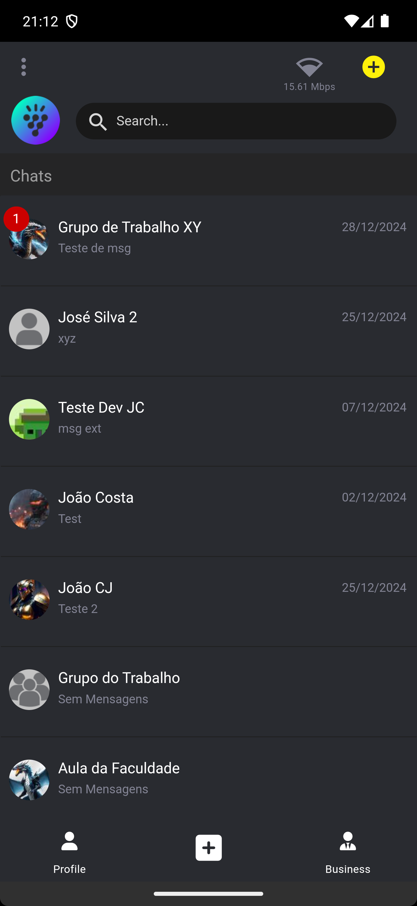

# Falaqui - Open Source Chat Application


**Falaqui** is a simple, private, and secure chat application designed for both personal and business use. With end-to-end encryption, offline message access, and support for text, media, audio transcripts, and more, Falaqui aims to be an open-source alternative to popular chat apps like WhatsApp and Telegram.

*This article can also be read in [Brazilian Portuguese](README-pt-BR.md).*

## Table of Contents
- [About](#about)
- [Features](#features)
- [Screenshots](#screenshots)
- [Tech Stack](#tech-stack)
- [Installation](#installation)
- [License](#license)

## About


Falaqui is an open-source chat application that prioritizes privacy and security. It allows users to send messages, share files, and communicate in groups with end-to-end encryption. Whether you're chatting with friends, family, or coworkers, Falaqui ensures your conversations remain private and secure.

### Motivation
The motivation behind Falaqui is to provide a transparent and secure alternative to closed-source chat applications that may collect or retain sensitive user data. By being open-source, Falaqui allows users to verify the security and privacy of the application themselves.

### Goals
- Provide a secure and private messaging platform.
- Offer an open-source alternative to popular chat apps.
- Support both personal and corporate communication needs.

## Features

- **Instant Messaging**: Send and receive text messages instantly.
- **Audio Transcription**: Send and receive audio messages with automatic transcription.
- **Media Sharing**: Share photos and images securely.
- **Contact Integration**: Find contacts directly from your phonebook.
- **Group Communication**: Create and manage groups for personal or corporate use.
- **Corporate Features**: Set date and time restrictions for corporate group access.

## Screenshots

| Splashscreen | Login Screen | Login with Localized Phone Number |
|--------------|--------------|-----------------------------------|
|  |  |  |

| Home Screen | Chat Screen | Chat Screen with Media |
|-------------|-------------|------------------------|
|  |  |  |

| Home Screen with Notification | Group Create/Edit Screen | Company Setup Screen | Account Settings Screen |
|-------------------------------|--------------------------|----------------------|-------------------------|
|  |  |  |  |

## Tech Stack

### Backend
- **Node.JS** with **Express**
- **Websocket Server** for individual and group chat
- **Redis** for caching server information
- **Whisper** for server-side audio transcription

### Database
- **MySQL Server**

### Push Notification
- **Firebase Cloud Messaging** (Android and iOS)

### Frontend
- **Apache Cordova**
- **JavaScript**
- **MaterializeCSS**
- **Pug** (HTML Pre-processor)

### Apache Cordova Plugins
- **Swift** and **ObjectiveC** for iOS
- **Java** for Android
- **C/C++** for iOS and Android
- **WhisperCPP** for client-side audio transcription (offline transcription)

## Installation

### Get Started and Run

This section is currently under construction. Please check back later for detailed instructions on how to set up and run Falaqui locally.

#### 1. Requirements

A set of installation and configuration is required, such as:
- Node.JS
- MySQL Server
- Redis
- Firebase Cloud Messaging
- C/C++ Build Environment
- \+ a set of support packages

Follow the instructions below to start setting up your environment.

##### Server Setup Requirements

Choose the platform on which you want to set up your environment and follow the instructions as per the related link.

| Platform             | Instructions                                   |
|----------------------|-----------------------------------------------|
| **Linux Ubuntu**     | [Linux Ubuntu Requirements Setup Guide](docs/platforms/linux-ubuntu/requirements/README.md) |
| **MacOS Apple Silicon** | [MacOS Requirements Setup Guide](docs/platforms/mac/requirements/README.md) |
| **Windows**          | [Windows Requirements Setup Guide](docs/platforms/win/requirements/README.md) |

*Note: These instructions can be adapted to platforms other than those listed above.*

#### 2. Server Setup
Download or clone the latest version of the code.

##### 2.1 Development Server Start
For development purposes you may just run:
```bash
node server.js
```

##### 2.2 Production Server Start (Daemon)
To run the server in background (daemon) with NODE_ENV in "production mode", use the PM2 command:
```bash
pm2 start start-flq-server-ecosystem.json --env production
```
*Note: The ecosystem file start-flq-server-ecosystem.json contains the environment configuration for production.*

To facilitate MacOS and Linux users there are the shell script start-flq-server.sh that can be used to start the process.
```bash
./start-flq-server.sh
```

To know more about PM2 and its commands, please check the PM2 documentation at https://pm2.keymetrics.io/docs/usage/process-management.


### Mobile App Build Requirements
Coming soon...

### Mobile App Build
Coming soon...

## License

Falaqui is licensed under the **AGPL-3.0 License**. This license allows you to:
- Use the software for any purpose.
- Modify and distribute the software.
- Use the software commercially.

However, any modifications or distributions must also be licensed under the AGPL-3.0 License, and the source code must be made available to users.

## Official App Stores

- **Apple Store**: [Download on the App Store](https://apps.apple.com/us/app/falaqui/id6503642039)
- **Google Play**: [Get it on Google Play](https://play.google.com/store/apps/details?id=com.br.falaqui)
- **Samsung Galaxy**: [Download on Samsung Galaxy Store](https://galaxystore.samsung.com/detail/com.br.falaqui)

## Official WebSites

- **Main: Portuguese (pt-BR)**: [Visit](https://FalaQui.com.br)
- **English Version**: [Visit](https://FalaQui.com)
- **Org Version (pt-BR)**: [Visit](https://FalaQui.org)

---

**Falaqui** - Your private, secure, and open-source chat solution.
